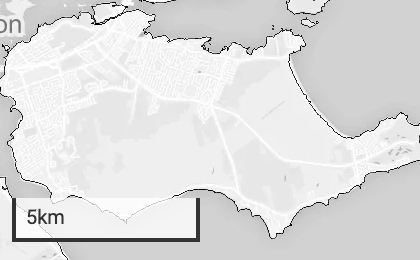

In this section you will learn how to customise the JMap api.

# Set a custom div container id for the map

When the API start it will create or use an existing div container in which the map will be inserted into.

By default the div container id is "***jmap-map***", but you can set the id of your choice like that :
```html
...
<html>
  <body>
    <script type="text/javascript">
      window.JMAP_API_OPTIONS = {
        ...
        map: {
          containerId: "my-custom-container-id"
        }
      }
    </script>
    <div id="my-custom-container-id"></div>
  </body>
</html>
```

In the above example the map will be inserted in the div having "my-custom-container-id" as id. You need to set the width and the height of this div by yourself.

If no container is found in the DOM with the specified id, JMap API will create and append it automatically in the body element of the web page.

# Make the session never to expire

You can tell the API to never lost the session after a user inactivity. For that the JS API will ping the server every 5 minutes if no activity is done in order to keep the session alive.

To activate the option, use the "***noSessionExpiration***" parameter :

```html
...
<html>
  <body>
    <script type="text/javascript">
      window.JMAP_API_OPTIONS = {
        ...
        noSessionExpiration: true
      }
    </script>
    ...
  </body>
</html>
```

# Map options

There is some map related options that you can customize by yourself.

## Map options : The mapbox token

If a mapbox token is set through the JMap Admin server interface, the API will use it automatically, nothing else to do for you. The Mapbox token is by JMap in order to fully used Mapbox capabilities like displaying a nice base map by example.

But if no token is set in the JMap administration, or if you want to use the mapbox token of your choice, you have to set the "***mapboxToken***" parameter :

```html
...
<html>
  <body>
    <script type="text/javascript">
      window.JMAP_API_OPTIONS = {
        ...
        map: {
          mapboxToken: "dfqwdhjgqdhdh4567sjdvhbh"
        }
      }
    </script>
    ...
  </body>
</html>
```

## Map options : The scale control parameters

The scale control is the panel on the bottom left of the image :



By default it is not visible. But you can show it on the map at the position you want, and you can choose the unit to display.

For that 3 optional parameters are available :

  - "***scaleControlVisibility***" : if true will display the scale control panel.
  - "***scaleControlPosition***" : The position of the scale control on the map, one of the following : "**top-left**" | "**top-right**" | "**bottom-left**" | "**bottom-right**".
  - "***scaleControlUnit***" : The units displayed, one of the following : "**imperial**" |  "**metric**" |  "**nautical**"

```html
...
<html>
  <body>
    <script type="text/javascript">
      window.JMAP_API_OPTIONS = {
        ...
        map: {
          scaleControlVisibility: true,
          scaleControlPosition: "bottom-right",
          scaleControlUnit: "imperial"
        }
      }
    </script>
    ...
  </body>
</html>
```

## Map options : The center of the map

You can set the location of the center of the map by setting the ***center*** parameter. By exemple if you want to center the map on the city of Ottawa :

```html
...
<html>
  <body>
    <script type="text/javascript">
      window.JMAP_API_OPTIONS = {
        ...
        map: {
          center: {
            x: -75.6981200,
            y: 45.4111700
          }
        }
      }
    </script>
    ...
  </body>
</html>
```

## Map options : Zoom to a custom level

You can zoom to a custom level by setting the "***zoom***" variable. Here an example :

```html
...
<html>
  <body>
    <script type="text/javascript">
      window.JMAP_API_OPTIONS = {
        ...
        map: {
          zoom: 4.32
        }
      }
    </script>
    ...
  </body>
</html>
```

## Map options : Execute a custom JS code when the map is ready on startup

You can execute a custom piece of code at runtime, after the map is ready, and only one time at JMap Js API startup. For that you have to set the "***onStartupMapReadyFn***" parameter which is a function. Here an example that will display a message "Hello the map is ready !" in the console :

```html
...
<html>
  <body>
    <script type="text/javascript">
      window.JMAP_API_OPTIONS = {
        ...
        map: {
          onStartupMapReadyFn: map => {
            console.log("Hello the map is ready !", map)
          }
        }
      }
    </script>
    ...
  </body>
</html>
```
